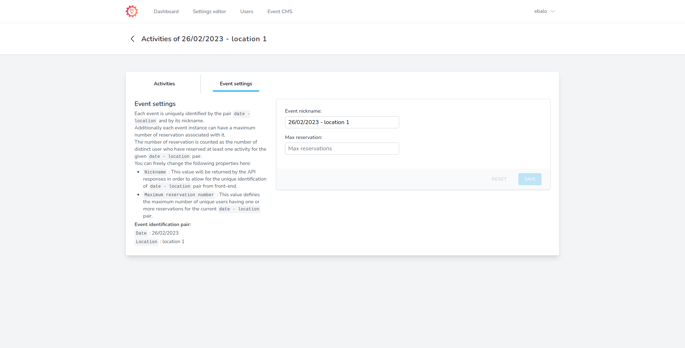

# Dashboard

In this page

[Site name](dashboard.md#site-name)

[Event dates](dashboard.md#event-dates)

[Registration date-time range](dashboard.md#registration-date-time-range)

[Total imported users](dashboard.md#total-imported-users)

[Latest import errors](dashboard.md#latest-import-errors)

<figure><figcaption>
OpenForum - Dashboard
</figcaption></figure>

The dashboard is the first place you'll visit once you get logged in.\
It is designed to be minimal and will give you an overview of the global state of your installation.

#### Site name

<figure><figcaption>
OpenForum - Dashbord - Site name card
</figcaption></figure>

description

#### Event dates

<figure><figcaption>
OpenForum - Dashbord - Event dates card
</figcaption></figure>

description

#### Registration date-time range

<figure><figcaption>
OpenForum - Dashbord - Registration date-time range card
</figcaption></figure>

description

#### Total imported users

<figure><figcaption>
OpenForum - Dashbord - Total imported users card
</figcaption></figure>

description

#### Latest import errors

<figure><figcaption>
OpenForum - Dashbord - Latest import errors card
</figcaption></figure>

description
